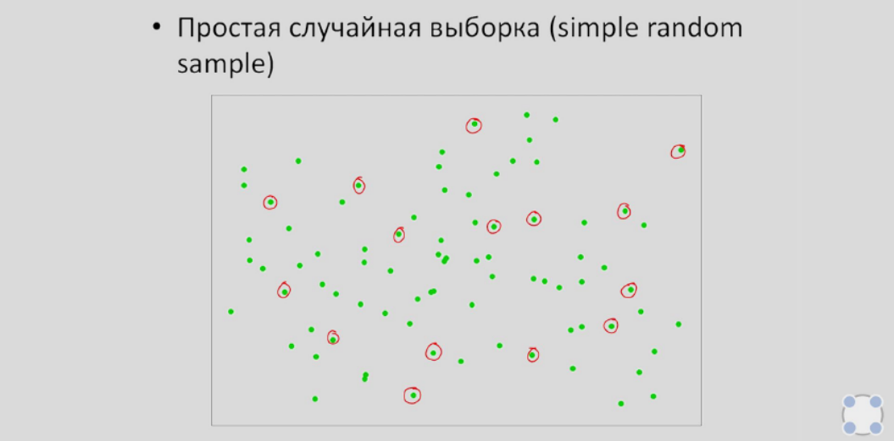
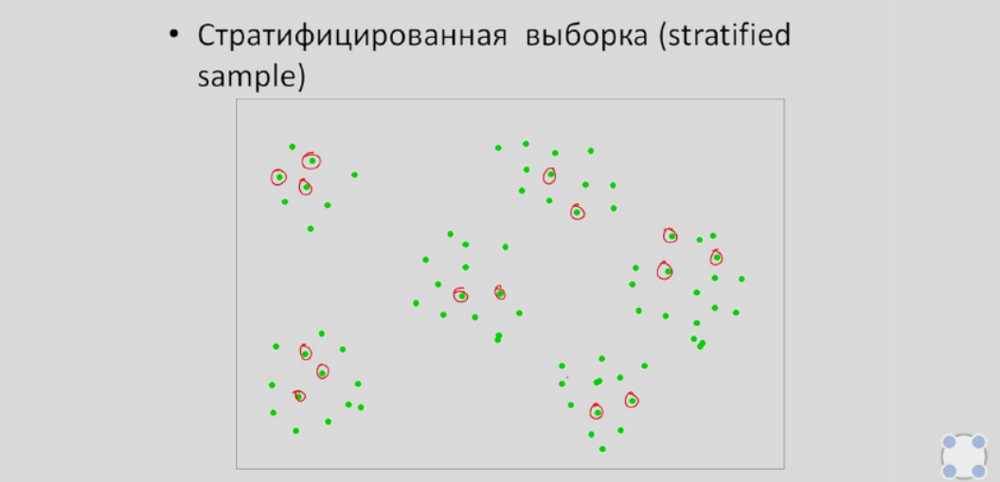
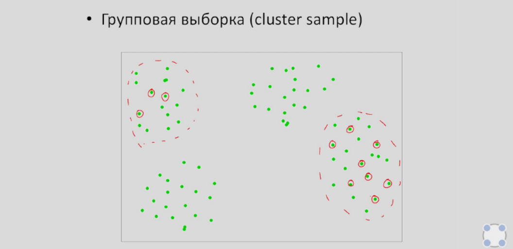
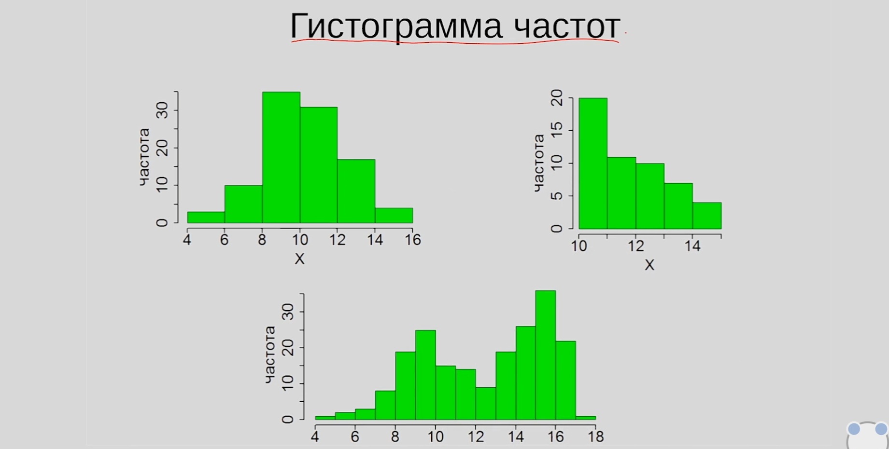
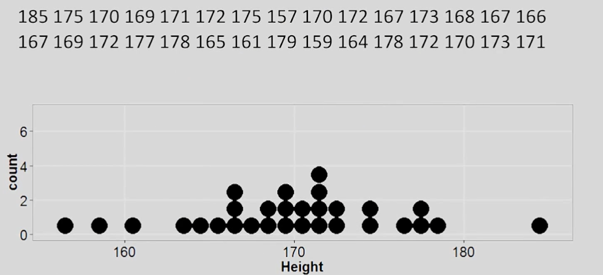






## Генеральная совокупность и выборка
Генеральная совокупность — это множество всех объектов, относительно которых предполагается делать выводы в рамках конкретного исследования.

Выборка — часть генеральной совокупности. Требуется, если невозможно провести исследования над целой генеральной совокупностью (всеми её объектами).

Репрезентативная выборка — это такая выборка, в которой все основные признаки генеральной совокупности, из которой извлечена данная выборка, представлены приблизительно в той же пропорции или с той же частотой, что и в этой генеральной совокупности.

Способы выборок:
1. Простейшая случайная выборка. В ней объекты, очевидно, выбираются случайным образом.

2. Стратифицированная выборка. В ней генеральная совокупность разбивается на страпы (группы) на основе определённого признака/признаков, затем из каждой группы берутся элементы с равной вероятностью.

3. Групповая (кластерная) выборка. Совокупность также разделяется на группы, но в этот раз случайным образом (чтобы были похожи между собой). Следующим шагом выбираются несколько групп, из которых берутся элементы.

---
## Типы переменных
Переменными выборки называют те или иные признаки объектов, которые собираются исследовать.

**Количественные** — переменные, которые можно измерить (к примеру, рост). Если переменная может принимать любое значение на определённом промежутке, то она называется **непрерывной** количественной переменной (рост в промежутке от 150 до 200). **Дискретными** переменными называются те, которые могут принять отдельное возможное значение с определённой вероятностью (количество детей в семье).

**Номинативные (качественные)** — также бывают двух видов. Первые — **номинальные** переменные, использующиеся как имена для групп. Например, можно обозначить группу мужчин за x, а группу женщин ща y. Вторые — **ранговые** переменные, представляющие упорядоченные категории. К примеру, степень удовлетворённости обслуживанием в кафе или порядковый номер бегуна в забеге.

---
## Меры центральной тенденции
Гистограмма частот — графическое представление распределения количественного признака.

Познакомимся с двумя типами описательных статистик. 

### Меры центральной тенденции
Меры центральной тенденции — значения, вычисленные тем или иным путём исходя из графика, описывающие множество значений самого графика.

Допустим, имеются 1000 значений некоторой количественной переменной. Требуется описать эти данные всего одним числом, содержащим ценную информацию.

**Мода** — значение измеряемого признака, встречающееся наиболее часто.

Рассмотрим следующий график. Значением, которое встречается чаще всего, является 172 — оно и будет модой распределения. Исключим одно значение, равное 172. Теперь имеем моду сразу из трёх значений: 167, 170, 172.

**Медиана** — значение признака, которое делит упорядоченное множество данных пополам.

При <u>нечётном</u> количестве элементов медианой является середина множества. При <u>нечётном</u> же — среднее арифметическое двух центральных значений признака.

Возьмём только первые 9 значений из предыдущего графика. Имеем след. значения: 157, 159, 161, 164, 165, 166, 167, 167, 167. В данном случае медианой является значение 165.

**Среднее значение** — среднее арифметическое всех значений признака.

Данный показатель (вернее, среднее арифметическое) обладает некоторыми свойствами:
* Если каждый элемент выборки увеличить на одно и то же число, то и среднее значение увеличится на это число.
* Если каждый элемент выборки умножить на одно и то же число, то и среднее значение у на это число.
* Если для каждого значения выборки рассчитать его отклонение от среднего арифметического, то сумма этих отклонений будет равна 0.  

Обозначение: \\(M\\) — для ГС или \\(\bar{x}\\) — для выборки

Представленное выше распределение симметрично, унимодально и не имеет заметных выбросов, поэтому для его описания можно использовать любую меру. В ином случае следует избежать использования среднего значения. 

---
## Меры изменчивости
Чтобы рассчитать показатели, характеризующие изменчивость исследуемого признака, можно использовать следующие меры:

**Размах** (range) — разность между максимальным и минимальным значением распределения. Данная мера использует всего два значения, из-за чего не является достаточно показательной.  
Обозначение: \\(R\\)

**Дисперсия** — средний квадрат отклонений индивидуальных значений признака от их средней величины. 

Она вычисляется по следующей формуле: \\(D = \frac{\sum(x_i - \bar{x})^2}{n}\\). Важно уточнить, что данная формула применима только к генеральной совокупности. Для расчёта дисперсии выборки из знаменателя вычитают единицу: \\(D = \frac{\sum(x_i - \bar{x})^2}{n-1}\\)  
Обозначение: \\(D\\) или \\(\sigma^2\\)

**Среднеквадратичное отклонение** — реальное среднее значение отклонений, получаемое извлечением корня из дисперсии. Соответственно, для нахождения, пользуемся формулой:
$$
\sqrt{\delta = \frac{\sum(x_i - \bar{x})^2}{n-1}}
$$
Обозначение: \\(\sigma\\) — для ГС или \\(sd\\) — для выборки

Разберём некоторые свойства дисперсии:  
1. \\(D_{x+c} = D_x\\)  
\\(sd_{x+c} = sd_x\\)  
2. \\(D_{xc} = D_x * x^2\\)  
\\(sd_{xc} = sd_x * x\\)